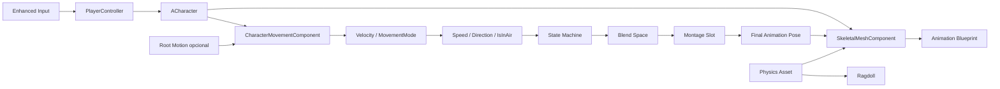
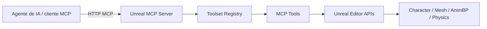
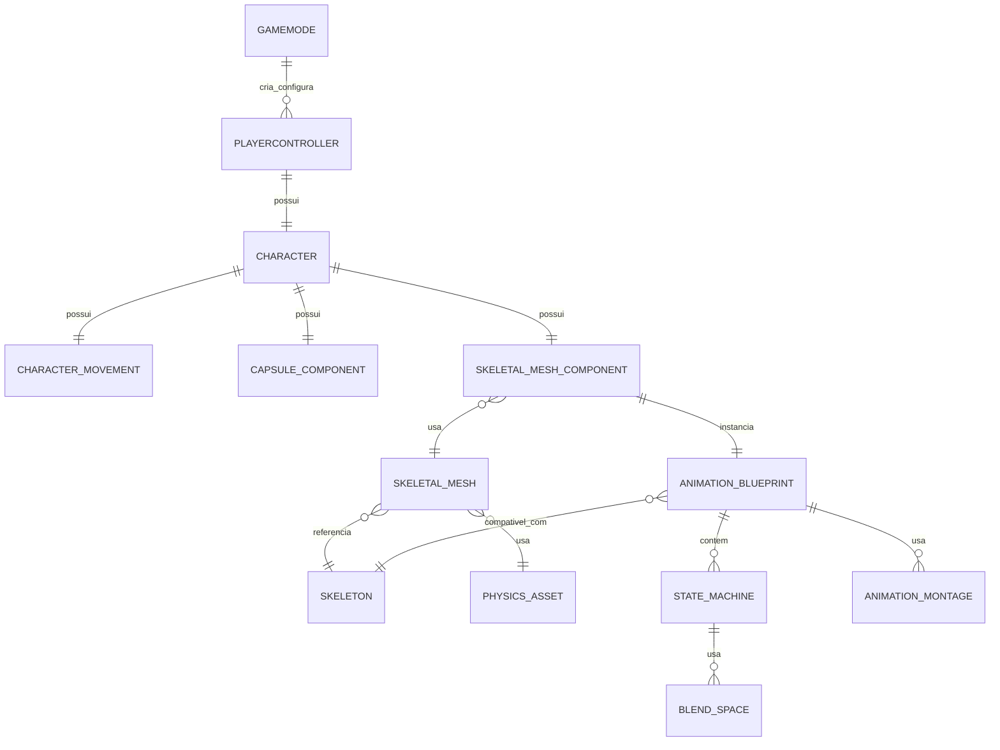
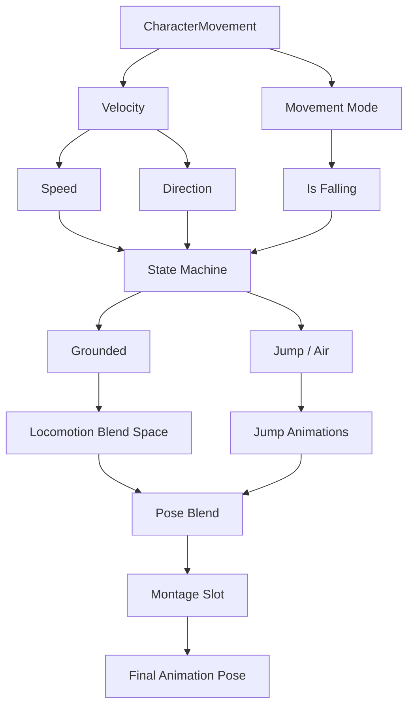

# Guia rigoroso para criar um jogador com boneco customizado na Unreal Engine: Mesh, Character, Physics e Unreal MCP

## Resumo executivo

A forma tecnicamente mais segura de construir um jogador humanoide customizado do zero na Unreal Engine é separar o problema em quatro camadas: **asset de personagem** (Skeletal Mesh + Skeleton + animações), **avatar jogável** (`ACharacter` + `CharacterMovementComponent` + cápsula), **sistema de animação** (Animation Blueprint + State Machine + Blend Spaces/Montages) e **física** (Physics Asset + collision + ragdoll). Essa divisão é consistente com o Gameplay Framework e com o pipeline de animação da Epic: `ACharacter` já traz `CapsuleComponent` e `CharacterMovementComponent`, incluindo suporte robusto a movimento replicado, enquanto o `SkeletalMeshComponent` é responsável pela representação visual e animação. citeturn23view0turn23view2

Há uma ambiguidade importante no termo **“MCP”**. Na documentação oficial atual, **Unreal MCP significa Model Context Protocol**, um plugin experimental introduzido no ciclo da Unreal Engine 5.8 para permitir que agentes de IA controlem funcionalidades do editor via servidor MCP local. Não encontrei na documentação oficial consultada um subsistema Epic denominado formalmente “Mesh/Character/Physics”. Portanto, neste relatório uso **Mesh/Character/Physics como uma interpretação funcional da sua sigla**, mas trato separadamente o **Unreal MCP oficial**. citeturn19view0

Isso gera uma conclusão importante para “usar apenas MCP”: **o Unreal MCP não substitui Skeletal Mesh, Skeleton, Character, Animation Blueprint ou Physics Asset**. Ele é uma interface para chamar ferramentas do editor. Além disso, a Epic avisa explicitamente que o plugin é experimental, possui funcionalidades ainda ausentes e que os toolsets disponíveis determinam o que um agente consegue realmente fazer. Um pipeline integral de personagem “somente por MCP” em UE5.8 é viável apenas na medida em que existam tools para cada operação — ou se você criar toolsets MCP próprios em Python/C++ que encapsulem importação, criação de assets, edição de Blueprints, validação etc. citeturn19view0

Para o personagem propriamente dito, as decisões mais importantes são:

| Decisão | Recomendação para um projeto novo |
|---|---|
| Base runtime | `ACharacter`, não um `APawn` genérico, salvo mecânicas muito incomuns. `Character` já integra cápsula, movimento humanoide e replicação. citeturn23view0turn23view2 |
| Sistema de input UE5 | Enhanced Input: `InputAction` + `InputMappingContext`. citeturn23view1 |
| Locomoção | **In-place + CharacterMovement** como padrão; root motion seletivo em Montages para golpes, vaults e movimentos autorados. citeturn22view1turn23view2 |
| Animação | AnimBP → variáveis de movimento → State Machine → Blend Space → Slot/Montages → Output Pose. citeturn24search0turn24search4turn22view0 |
| Eixos | Unreal é left-handed, **+X forward, +Y right, +Z up**. Corrigir o DCC para esse contrato é preferível a compensações permanentes no componente Mesh. citeturn21view0 |
| Escala | Trabalhar visando **centímetros no Unreal** e escala uniforme/coerente desde o DCC. A unidade padrão de comprimento da UE é cm. citeturn21view1 |
| Root | Bone `root` independente no topo; idealmente origem/identidade na pose de referência. O pivot do Skeletal Mesh é determinado pelo root bone. citeturn19view2turn17search5 |
| Retarget UE5 | IK Rig + IK Retargeter para skeletons diferentes; ajustar Retarget Pose para diferenças A-pose/T-pose. citeturn22view2 |
| Física | Cápsula para locomoção; Physics Asset para corpos/constraints, hits específicos e ragdoll. citeturn23view0turn22view3 |
| Multiplayer | Deixar `CharacterMovementComponent` replicar o movimento; replicar **estado de gameplay**, não cada variável cosmética do AnimBP. citeturn23view2 |
| Performance | Fast Path/Property Access, LODs, Animation Budget Allocator, poucos corpos físicos; root motion global apenas quando justificado. citeturn23view3turn22view1 |

Em UE5.8, o pipeline FBX de Skeletal Mesh da Epic utiliza **FBX 2020.2**; usar versões diferentes pode gerar incompatibilidades. A documentação UE4.27 é de uma geração anterior do pipeline e usa versões FBX anteriores, portanto não é recomendável copiar presets antigos cegamente ao trabalhar em UE5.8. citeturn19view2turn16search1

A arquitetura final recomendada é:



Esse desenho evita três erros arquiteturais extremamente comuns: **fazer o mesh mover o personagem sem coordenação com a cápsula**, **usar a colisão per-bone como substituta da cápsula durante locomoção**, e **replicar manualmente posição/animação que o `CharacterMovementComponent` já foi projetado para sincronizar**. citeturn22view1turn22view3turn23view2

## Escopo, versões e o significado de MCP

A documentação oficial atualmente expõe **Unreal Engine 5.8** como a geração corrente, e nessa versão a Epic documenta o novo **Unreal MCP** como uma funcionalidade experimental. O servidor MCP é executado dentro do processo da Unreal, expõe funções do engine/editor como tools e é acessível por clientes compatíveis com Model Context Protocol. A documentação cita como exemplos inspeção/modificação de actors, materiais, Slate e execução de testes de automação. citeturn19view0

A relação conceitual é esta:



O setup oficial em UE5.8 é: habilitar os plugins **Unreal MCP** e **All Toolsets**, reiniciar o editor, configurar `Model Context Protocol` em Editor Preferences e conectar o cliente ao servidor. O endereço padrão é `http://127.0.0.1:8000/mcp`; o servidor também pode ser iniciado pelo console com `ModelContextProtocol.StartServer 8000`. A Epic fornece ainda `ModelContextProtocol.GenerateClientConfig`, inclusive para `ClaudeCode`, `Cursor`, `VSCode`, `Gemini`, `Codex` e `All`. citeturn19view0

Exemplo oficial de configuração gerada:

```json
{
  "mcpServers": {
    "unreal-mcp": {
      "type": "http",
      "url": "http://127.0.0.1:8000/mcp"
    }
  }
}
```

Há três limitações particularmente importantes para este projeto. Primeiro, a Epic diz que **muitas funcionalidades ainda estão incompletas ou ausentes**. Segundo, os tools não são implementados pelo MCP em si: eles vêm do `Toolset Registry` e dos toolsets habilitados. Terceiro, por padrão o servidor é loopback/local e não possui camada de autenticação, portanto não deve ser exposto diretamente na rede. citeturn19view0

Consequentemente, um prompt como:

```text
"Importe Character.fbx, crie Skeleton, PhysicsAsset, Animation Blueprint,
State Machine e configure o BP_PlayerCharacter"
```

**não possui garantia de ser executável somente com os toolsets padrão**. O procedimento rigoroso é primeiro pedir ao agente MCP que consulte `list_toolsets` e `describe_toolset` para descobrir quais operações estão realmente expostas. No modo padrão de Tool Search do UE5.8, essas meta-tools são precisamente o mecanismo oficial de descoberta. citeturn19view0

Quando uma operação de personagem não está exposta, a solução MCP tecnicamente correta é criar um **custom Toolset**. A Epic documenta toolsets em Python derivados de `unreal.ToolsetDefinition`, com funções decoradas como tool calls, e toolsets C++ derivados de `UToolsetDefinition`, cujos métodos `UFUNCTION` podem ser marcados como chamáveis por IA. citeturn19view0

Assim, “apenas Unreal MCP” deve ser entendido como:

> **o agente chama somente MCP, mas os tools MCP internamente continuam usando as APIs normais da Unreal.**

Não há como abolir o `Skeleton`, o `ACharacter`, o `Animation Blueprint` ou o `PhysicsAsset`: eles continuam sendo os ativos e sistemas runtime.

Existe também uma fronteira fora da Unreal: o **rig original no DCC**. O Unreal MCP oficial controla Unreal; ele não cria automaticamente um armature no Maya, Blender ou Houdini. Para automatizar também essa etapa, seria necessário outro servidor MCP para o DCC ou uma ferramenta externa/customizada. Isso é uma consequência direta do escopo do servidor descrito pela Epic. citeturn19view0

Para diferenças de versão, a matriz prática é:

| Tema | UE4.27 | UE5 moderno / 5.8 |
|---|---|---|
| Player | `ACharacter` + `CharacterMovement` já eram a solução padrão. citeturn21view2turn23view0 | Mesma base; networking de CharacterMovement continua central. citeturn23view2 |
| Input | Action/Axis Mappings tradicionais | Enhanced Input é a arquitetura moderna e é habilitado por padrão nos fluxos UE5. citeturn23view1 |
| Retarget | Skeleton retargeting + Retarget Manager/Humanoid Rig. citeturn10search15turn21view3 | IK Rig + IK Retargeter; UE5.8 inclui um Retargeting Stack mais modular. citeturn22view2 |
| Física | Pipeline anterior ao Chaos nas versões UE4 tradicionais | Chaos é a solução física da geração UE5. citeturn14search7 |
| FBX | Documentação UE4.27 de geração anterior usa FBX 2018 no pipeline. citeturn16search1 | Documentação Skeletal Mesh 5.8 especifica FBX 2020.2. citeturn19view2 |
| Unreal MCP | Não existe o plugin oficial UE5.8 | Experimental em UE5.8. citeturn19view0 |

## Pipeline do DCC ao Skeletal Mesh: rig, hierarquia, eixos e FBX

O melhor lugar para resolver escala, orientação, bind pose e estrutura óssea é **antes da importação**. `Import Rotation` e `Import Uniform Scale` são úteis para exceções e migrações, mas uma pipeline estável deve produzir FBXs que já chegam ao Unreal com o contrato espacial correto. A Unreal usa sistema cartesiano **left-handed, Z-up**, com **+X para frente, +Y para direita e +Z para cima**. citeturn21view0

A unidade de comprimento padrão é **centímetro**. Isso significa que um personagem humano com aproximadamente 1,80 m deverá medir aproximadamente 180 cm no espaço Unreal, e não 1,8 unidades. citeturn21view1

### Contrato recomendado do skeleton

Apesar de a Unreal não impor uma nomenclatura universal de bones para personagens customizados, ela impõe requisitos estruturais quando se deseja **compartilhar o mesmo Skeleton asset**: nomes e ordem/hierarquia dos ossos compartilhados devem permanecer consistentes; ossos periféricos adicionais podem ser acrescentados sem necessariamente invalidar o compartilhamento. citeturn21view2

A nomenclatura abaixo é, portanto, uma **convenção de projeto recomendada**, não uma regra universal da Epic:

| Função | Convenção sugerida | Exemplo | Motivo |
|---|---|---|---|
| Root global | nome simples e estável | `root` | Ponto global de movimento/retarget/root motion. “root” também é reconhecido pelas heurísticas de chain naming do IK Rig. citeturn22view2 |
| Centro corporal | sem lado | `pelvis`, `spine_01`, `spine_02`, `neck_01`, `head` | Hierarquia legível e previsível. |
| Braço esquerdo | sufixo de lado consistente | `clavicle_l`, `upperarm_l`, `lowerarm_l`, `hand_l` | Facilita scripts, IK e espelhamento. |
| Braço direito | mesma estrutura | `clavicle_r`, `upperarm_r`, `lowerarm_r`, `hand_r` | Simetria lógica. |
| Perna | estrutura semântica | `thigh_l`, `calf_l`, `foot_l`, `ball_l` | Facilita retarget e IK. |
| Dedos | nome + índice/segmento | `index_01_l`, `index_02_l`, etc. | Busca e automação previsíveis. |
| IK auxiliar | prefixo identificável | `ik_foot_l`, `ik_hand_r` | Separa deformação de controle/IK. |
| Socket | sufixo explícito | `weapon_r_socket`, `head_fx_socket` | Evita confundir socket com bone. |
| Virtual Bone | deixar o sistema identificar | `VB ...` | Virtual Bones são um mecanismo próprio da Unreal; não devem ser tratados como bones de skin exportados. citeturn6search5 |

Para retargeting UE5, os nomes exatos podem ser diferentes porque o IK Retargeter trabalha por **chains**, e a Epic explicitamente permite nomes arbitrários com correspondência entre as chains. As heurísticas automáticas reconhecem palavras como `head`, `neck`, `leg`, `thigh`, `calf`, `foot`, `arm`, `clavicle`, `hand`, `spine`, `root` etc.; isso torna nomes semânticos uma vantagem real. citeturn22view2

Uma hierarquia humanoide robusta seria conceitualmente:

```text
root
└── pelvis
    ├── spine_01
    │   └── spine_02
    │       └── spine_03
    │           ├── neck_01
    │           │   └── head
    │           ├── clavicle_l
    │           │   └── upperarm_l
    │           │       └── lowerarm_l
    │           │           └── hand_l
    │           └── clavicle_r
    │               └── upperarm_r
    │                   └── lowerarm_r
    │                       └── hand_r
    ├── thigh_l
    │   └── calf_l
    │       └── foot_l
    │           └── ball_l
    └── thigh_r
        └── calf_r
            └── foot_r
                └── ball_r
```

`root` e `pelvis` não devem ser usados como sinônimos. O **root** é a referência global ideal para deslocamento do personagem/root motion; o **pelvis** representa o centro anatômico e normalmente recebe movimento corporal local. Essa separação simplifica root motion, retargeting, montagem de IK e ragdoll. A documentação de retargeting, inclusive, exige que o pelvis seja explicitamente identificado para que root motion possa ser transferido proporcionalmente. citeturn22view2

Para root motion, a documentação UE4 da Epic recomenda que o Root Bone esteja na origem, sem transformação problemática, para que o movimento físico possa ser separado do movimento animado; a documentação UE5 atual mantém a distinção de root global e oferece inclusive `Root Motion Root Lock` em Reference Pose, First Frame ou Zero. citeturn17search5turn22view1

O pivot do Skeletal Mesh merece atenção especial: no pipeline FBX da Unreal, **o pivot do Skeletal Mesh é o root bone/joint**. A Epic explica que, independentemente de onde o skeleton esteja colocado na cena do DCC, o root é tratado como origem do Skeletal Mesh na exportação/importação. citeturn19view2


Imagem da documentação oficial do pipeline FBX de Skeletal Mesh. citeturn19view2

### Sockets

Sockets são offsets de attachment associados a bones, ideais para arma, escudo, acessórios, VFX e pontos de interação. A Unreal permite **Skeleton Sockets**, compartilhados pelos meshes que usam aquele Skeleton, e **Mesh Sockets**, que sobrescrevem/customizam um socket para um Skeletal Mesh específico. citeturn21view3

Regra prática:

```text
hand_r
└── weapon_r_socket
```

Não crie um bone deformador apenas porque precisa anexar uma espada. Use um socket. Crie bone real quando ele precisa participar de skinning, animação, física ou uma hierarquia que precise existir no FBX.

### Skinning e pesos

O bind deve ser feito em pose de referência limpa, evitando escalas não uniformes ou transforms residuais no rig. Maya e 3ds Max são os dois DCCs explicitamente usados pela Epic na documentação corrente do pipeline FBX de Skeletal Mesh; a própria documentação descreve Smooth Bind no Maya e Skin modifier no 3ds Max. citeturn19view2

DCCs viáveis:

| DCC | Adequação |
|---|---|
| **Autodesk Maya** | Referência mais diretamente coberta pela documentação Epic de Skeletal Mesh/FBX; excelente para rigging e animação. citeturn19view2 |
| **3ds Max** | Também explicitamente documentado pela Epic para Skeleton/Skin/FBX. citeturn19view2 |
| **Blender** | Alternativa comum e gratuita; atenção especial ao mapeamento de bone axes e transformação FBX. O próprio manual Blender expõe opções de Primary/Secondary Bone Axis. citeturn16search2 |
| **Houdini/KineFX** | Muito forte para pipelines procedurais. A SideFX oferece `KineFXtoUnreal` e exportadores de personagem; há opção para remover scale dos joints visando cálculos físicos corretos na Unreal. citeturn16search3turn16search27 |
| **MotionBuilder** | Útil sobretudo para mocap, characterização e animação/retarget; a Epic possui integração Live Link histórica para o fluxo UE4. citeturn16search25 |

### Triangulação e mesh

A Epic recomenda controlar a triangulação no DCC. O hardware renderiza triângulos e deixar a triangulação ocorrer automaticamente na exportação/importação reduz o controle artístico e pode alterar edge flow e smoothing. citeturn19view2

A Unreal aceita um Skeletal Mesh composto por várias partes skinnadas ao mesmo skeleton; a documentação destaca inclusive que essas partes são combinadas durante a importação e que a divisão pode facilitar personagens modulares e LODs independentes. citeturn19view2

### Exportação FBX

Na UE5.8, o alvo documentado é **FBX 2020.2**. citeturn19view2

Um preset conceitual de exportação é:

```text
Selection:
    Mesh(es)
    Deformation skeleton only

Transforms:
    Scale consistente com centímetros
    Sem non-uniform scale residual
    Root coerente/origem
    Facing preparado para +X na Unreal

Geometry:
    Smoothing / normals conforme pipeline
    Tangents se DCC for autoridade
    Triangulated = preferencialmente já resolvido no DCC

Animation:
    OFF para arquivo base mesh/skeleton
    ON para arquivos de animação
    Bake Animation = quando necessário

Extras:
    Evitar exportar control rigs, helpers e constraints
    que não precisam virar bones no Skeleton runtime
```

O objetivo é exportar o **deformation skeleton**, não toda a maquinaria do rig de animação.

### Configurações de importação FBX

A tabela abaixo parte das opções documentadas pelo importador atual da Unreal. citeturn19view3

| Opção | Para primeiro import do personagem | Quando alterar |
|---|---|---|
| `Skeletal Mesh` | **On** | Obrigatório para personagem skinnado. citeturn19view3 |
| `Import Mesh` | **On** | Off em fluxo de animação-only quando aplicável. citeturn19view3 |
| `Skeleton` | **None** | None cria um Skeleton novo; selecione um existente somente se o mesh realmente satisfaz o contrato de hierarquia. citeturn19view3turn21view2 |
| `Import Animations` | Normalmente **Off** no arquivo base | On para um FBX especificamente destinado a animações. citeturn19view3 |
| `Update Skeleton Reference Pose` | **Off** | Só habilitar deliberadamente ao substituir a reference pose. citeturn19view3 |
| `Use T0 As Ref Pose` | **Off** | Usar apenas se frame 0 foi construído intencionalmente como reference pose. citeturn19view3 |
| `Import Morph Targets` | Conforme necessidade | On para face/blendshapes ou deformations adicionais. citeturn19view3 |
| `Import Mesh LODs` | On apenas se houver LODs autorados | Caso contrário gere/prepare LODs depois. citeturn19view3 |
| `Normal Import Method` | Depende do pipeline | `Import Normals and Tangents` se o DCC deve ser autoridade; `Compute Normals` quando quer o Unreal recalculando. citeturn19view3 |
| `Create Physics Asset` | **On** para bootstrap rápido | Off se já existe um PhysicsAsset preparado para associar posteriormente. O asset automático precisa ser revisado. citeturn19view3turn22view3 |
| `Import Uniform Scale` | **1.0** idealmente | Use outro valor como correção/migração, não como substituto de um pipeline de escala coerente. |

Depois do import, a validação mínima é: altura correta, +X forward, root correto, Reference Pose correta, normals corretas, material slots, peso de deformação, Skeleton Tree, Physics Asset e reprodução de pelo menos uma animação.

## Character, Player Controller e arquitetura de animação

No Gameplay Framework, o `PlayerController` representa a interface entre o humano e o Pawn; ele **possui** um Pawn/Character. `ACharacter`, por sua vez, é um Pawn humanoide com `CapsuleComponent` e `CharacterMovementComponent`, e já fornece comportamento especializado de movimento e integração de rede. citeturn23view0

Um modelo de entidades adequado é:



Na prática, um Blueprint `BP_PlayerCharacter` deve derivar de `Character`, e não ser apenas um Actor com um Skeletal Mesh solto. Isso garante que o “corpo lógico” do jogador seja a cápsula e o CharacterMovement, enquanto o mesh acompanha esse corpo. citeturn23view0turn23view2

A composição típica é:

```text
BP_PlayerCharacter
└── CapsuleComponent        <- root / colisão de locomoção
    ├── Mesh                <- personagem customizado
    └── SpringArm
        └── Camera
```

A cápsula deve ser ajustada à estatura do personagem; o mesh deve ser posicionado verticalmente dentro dela de forma que os pés coincidam aproximadamente com a base. Corrigir a orientação errada do asset no DCC é preferível a acumular offsets arbitrários no `Mesh`.

### Input e eixos

A base espacial a preservar é: **+X forward, +Y right, +Z up**. citeturn21view0

Com câmera terceira pessoa, “forward” de movimento normalmente não é simplesmente `ActorForwardVector`: calcula-se o forward a partir do **Yaw do Controller**, descartando pitch para não transformar “andar para frente” em movimento vertical quando a câmera olha para cima.

Em Enhanced Input, a arquitetura é:

```text
IA_Move   : Axis2D
IA_Look   : Axis2D
IA_Jump   : Boolean
IA_Sprint : Boolean

IMC_Player
├── W/S/A/D       -> IA_Move
├── Left Stick    -> IA_Move
├── Mouse         -> IA_Look
├── Right Stick   -> IA_Look
├── Space         -> IA_Jump
└── Shift         -> IA_Sprint
```

Input Actions e Mapping Contexts são os conceitos centrais do Enhanced Input; Contexts podem ser adicionados/removidos e priorizados em runtime, e modifiers conseguem inverter ou reorganizar eixos, aplicar dead zones etc. citeturn23view1

**Blueprint equivalente para `IA_Move`:**

```text
IA_Move (Triggered)
       │
       ├── Get Action Value (Vector2D)
       │      X = Right
       │      Y = Forward
       │
       └── Get Control Rotation
              │
              └── Break Rotator
                     │ Yaw
                     ▼
                Make Rotator
                Pitch=0
                Yaw=Yaw
                Roll=0
                 │
          ┌──────┴────────┐
          ▼               ▼
 Get Forward Vector   Get Right Vector
          │               │
 Add Movement Input  Add Movement Input
 Scale = Value.Y     Scale = Value.X
```

Para teclado, os Input Modifiers do Enhanced Input podem transformar W/S em eixo Y e A/D em eixo X, inclusive usando swizzle/negate conforme o mapping. citeturn23view1

### Implementação C++ de movimento

Um equivalente UE5, deliberadamente pequeno, pode ser:

```cpp
// MyPlayerCharacter.h

#pragma once

#include "CoreMinimal.h"
#include "GameFramework/Character.h"
#include "InputActionValue.h"
#include "MyPlayerCharacter.generated.h"

class UInputAction;
class UInputMappingContext;

UCLASS()
class AMyPlayerCharacter : public ACharacter
{
    GENERATED_BODY()

public:
    AMyPlayerCharacter();

protected:
    virtual void BeginPlay() override;
    virtual void SetupPlayerInputComponent(
        UInputComponent* PlayerInputComponent) override;

    UPROPERTY(EditDefaultsOnly, Category="Input")
    TObjectPtr<UInputMappingContext> DefaultMappingContext;

    UPROPERTY(EditDefaultsOnly, Category="Input")
    TObjectPtr<UInputAction> MoveAction;

    UPROPERTY(EditDefaultsOnly, Category="Input")
    TObjectPtr<UInputAction> LookAction;

    UPROPERTY(EditDefaultsOnly, Category="Input")
    TObjectPtr<UInputAction> JumpAction;

    void Move(const FInputActionValue& Value);
    void Look(const FInputActionValue& Value);
};
```

```cpp
// MyPlayerCharacter.cpp

#include "MyPlayerCharacter.h"

#include "EnhancedInputComponent.h"
#include "EnhancedInputSubsystems.h"
#include "GameFramework/CharacterMovementComponent.h"

AMyPlayerCharacter::AMyPlayerCharacter()
{
    bUseControllerRotationYaw = false;

    GetCharacterMovement()->bOrientRotationToMovement = true;
    GetCharacterMovement()->RotationRate = FRotator(0.f, 500.f, 0.f);
}

void AMyPlayerCharacter::BeginPlay()
{
    Super::BeginPlay();

    if (APlayerController* PC = Cast<APlayerController>(Controller))
    {
        if (ULocalPlayer* LP = PC->GetLocalPlayer())
        {
            if (UEnhancedInputLocalPlayerSubsystem* Subsystem =
                    ULocalPlayer::GetSubsystem<
                        UEnhancedInputLocalPlayerSubsystem>(LP))
            {
                if (DefaultMappingContext)
                {
                    Subsystem->AddMappingContext(
                        DefaultMappingContext, 0);
                }
            }
        }
    }
}

void AMyPlayerCharacter::SetupPlayerInputComponent(
    UInputComponent* PlayerInputComponent)
{
    Super::SetupPlayerInputComponent(PlayerInputComponent);

    UEnhancedInputComponent* Input =
        CastChecked<UEnhancedInputComponent>(PlayerInputComponent);

    Input->BindAction(
        MoveAction,
        ETriggerEvent::Triggered,
        this,
        &AMyPlayerCharacter::Move);

    Input->BindAction(
        LookAction,
        ETriggerEvent::Triggered,
        this,
        &AMyPlayerCharacter::Look);

    Input->BindAction(
        JumpAction,
        ETriggerEvent::Started,
        this,
        &ACharacter::Jump);

    Input->BindAction(
        JumpAction,
        ETriggerEvent::Completed,
        this,
        &ACharacter::StopJumping);
}

void AMyPlayerCharacter::Move(const FInputActionValue& Value)
{
    if (!Controller)
        return;

    const FVector2D Input = Value.Get<FVector2D>();

    const FRotator ControlRotation = Controller->GetControlRotation();
    const FRotator YawRotation(
        0.f,
        ControlRotation.Yaw,
        0.f);

    const FVector Forward =
        FRotationMatrix(YawRotation).GetUnitAxis(EAxis::X);

    const FVector Right =
        FRotationMatrix(YawRotation).GetUnitAxis(EAxis::Y);

    AddMovementInput(Forward, Input.Y);
    AddMovementInput(Right, Input.X);
}

void AMyPlayerCharacter::Look(const FInputActionValue& Value)
{
    const FVector2D Input = Value.Get<FVector2D>();

    AddControllerYawInput(Input.X);
    AddControllerPitchInput(Input.Y);
}
```

O padrão de `InputAction`, `UEnhancedInputComponent` e `AddMappingContext` segue a arquitetura documentada do Enhanced Input. citeturn23view1

### Animation Blueprint

Animation Blueprints são Blueprints especializados que calculam a pose final de um Skeletal Mesh. A arquitetura atual contém principalmente **Event Graph/Thread Safe logic** para obter dados e **AnimGraph** para produzir/blendar poses. citeturn24search1turn24search4

Variáveis mínimas de locomoção:

```text
Speed        : float
Direction    : float
bIsInAir     : bool
bIsCrouched  : bool
bIsMoving    : bool
```

Modelo didático:

```text
Event Blueprint Update Animation
    │
    ├─ Try Get Pawn Owner
    │
    ├─ Get Velocity
    │      └─ Vector Length XY -> Speed
    │
    ├─ Calculate Direction -> Direction
    │
    └─ CharacterMovement.IsFalling -> bIsInAir
```

Para UE5 moderno, porém, não convém transformar esse Event Graph num “segundo Character Blueprint”. A Epic recomenda reduzir lógica de Event Graph e aproveitar **Thread Safe Functions + Property Access/Fast Path**; o Event Graph roda sequencialmente no Game Thread, enquanto acessos simples no AnimGraph podem ser otimizados. citeturn23view3turn24search9turn24search21

A melhor separação é:

```text
Gameplay authority:
    Character / CharacterMovement

Animation observations:
    Velocity
    Acceleration
    MovementMode
    IsFalling
    Gameplay state

Pose decisions:
    Animation Blueprint
```

Isto evita que a animação passe a ser a autoridade indevida sobre mecânicas como stamina, sprint, velocidade ou estado de morte.

### State Machine e Blend Space

State Machines são sistemas modulares dentro do Animation Blueprint em que estados representam modos como Idle/Walking/Jumping, e Transition Rules determinam quando o personagem pode trocar de estado. citeturn24search0turn24search20

Um primeiro sistema robusto não precisa ter Idle, Walk e Run como três states separados. É normalmente mais simples ter:

```text
Locomotion
├── Grounded
│     └── BS_Locomotion
│
├── JumpStart
├── InAir
└── Land
```

O estado `Grounded` usa um Blend Space.

Blend Spaces permitem interpolar várias Animation Sequences de acordo com um ou dois valores de entrada. A Epic usa explicitamente o exemplo de locomoção com direção e velocidade. citeturn22view0

Exemplo 2D:

```text
Axis X = Direction
    -180 ... +180 graus

Axis Y = Speed
       0 ... MaxSpeed

Samples:
    Idle
    Walk Forward
    Run Forward
    Strafe Left
    Strafe Right
    Walk/Run Backward
```

Para um jogo sem strafe, um Blend Space 1D apenas por `Speed` é mais barato conceitualmente e muito mais simples.

Fluxo final:



Montages devem ficar como camada deliberada sobre a pose base quando você precisa de ataque, reload, interação, hit reaction etc., em vez de multiplicar states para ações transitórias.

### Root motion versus in-place

Root Motion permite que o deslocamento armazenado no root bone conduza o movimento do Character, em vez de a animação apenas acompanhar deslocamento produzido pelo CharacterMovement. citeturn22view1

| Critério | In-place | Root Motion |
|---|---|---|
| Autoridade de deslocamento | CharacterMovement/gameplay | Animação fornece deslocamento do root |
| Responsividade | Excelente para input contínuo | Muito dependente do clip |
| Locomoção multiplayer | **Recomendado como padrão** | Exige mais coordenação de rede |
| Fidelidade a ataque/vault | Pode haver foot sliding ou mismatch | Excelente para trajetórias autoradas |
| Mudança dinâmica de velocidade | Simples | Pode exigir rate scaling, Motion Warping ou outro tratamento |
| Colisão | Naturalmente dirigida pela cápsula/CMC | Unreal reaplica root motion ao MovementComponent/cápsula. citeturn22view1 |
| Paralelismo/performance | Mais favorável | Root Motion pode forçar atualização relevante no Game Thread e tem custo documentado. citeturn22view1turn23view3 |
| Melhor uso | Idle/walk/run/strafe/jump geral | Ataques, dodges, vaults e ações com trajetória artística |
| Recomendação multiplayer | Base locomotion | **Root Motion from Montages Only** para movimentos especiais, quando necessário. citeturn9search14turn9search6 |

A arquitetura híbrida costuma ser a melhor:

```text
Normal locomotion:
    Input
      -> CharacterMovement
      -> Velocity
      -> Blend Space in-place

Special authored action:
    Server-approved gameplay action
      -> Animation Montage
      -> Root Motion
      -> CharacterMovement
```

UE5 oferece ainda Motion Warping para modificar dinamicamente root motion em direção a alvos, útil para vault, takedown ou melee em que a animação precisa terminar exatamente em determinada posição. citeturn17search17

## Retargeting, Physics Asset, colisão e ragdoll

Há três casos diferentes de compartilhamento de animação.

**Mesmo Skeleton asset:** se os Skeletal Meshes satisfazem as regras de hierarquia/nome, podem compartilhar animações e até Animation Blueprints diretamente. A Epic permite ossos periféricos extras, desde que a hierarquia base não seja violada. citeturn21view2

**Skeletons diferentes, porém semelhantes:** UE5 oferece mecanismos de compatibilidade e retargeting; dependendo do caso, o compartilhamento compatível pode ser suficiente. citeturn10search1

**Skeletons realmente diferentes:** use **IK Rig + IK Retargeter**. O sistema consegue transferir animação entre skeletons com quantidades de bones, nomes e orientações diferentes, trabalhando por chains. citeturn22view2

Fluxo UE5:

```text
SK_Source
    ↓
IKRig_Source
    ├─ Root
    ├─ Spine
    ├─ ArmLeft
    ├─ ArmRight
    ├─ LegLeft
    └─ LegRight
         │
         ▼
    IK_Retargeter
         │
         ▼
IKRig_Target
         │
         ▼
SK_Custom
```

É crucial marcar o **pelvis** nos dois IK Rigs para o tratamento proporcional de root motion e alinhar a Retarget Pose. A documentação da Epic destaca explicitamente discrepâncias como source em A-pose e target em T-pose e recomenda ajustar uma Retarget Pose para obter melhor correspondência. citeturn22view2

Portanto, o personagem estar “com os braços estranhos” após retarget quase sempre deve ser investigado em:

```text
Reference pose
Retarget pose
Bone-chain mapping
Bone orientation
Proporções
IK goals
```

e não corrigido primeiro com uma rotação global do Mesh Component.

Em UE4.27, a abordagem clássica envolve Retarget Manager/Humanoid Rig e as opções de Translation Retargeting do Skeleton. A Skeleton Tree oferece `Animation`, `Skeleton`, `AnimationScaled` e `AnimationRelative`. citeturn10search15turn21view3

### Physics Asset

Um `PhysicsAsset` define os **rigid bodies e constraints** usados para física e colisão de um Skeletal Mesh; o conjunto pode constituir um ragdoll. A Unreal permite criá-lo automaticamente no import ou posteriormente. citeturn22view3

A geração automática é um ponto de partida, não produto final.

Para humanoide, comece com corpos aproximadamente em:

```text
pelvis
spine/chest
head

upperarm_l/r
lowerarm_l/r

thigh_l/r
calf_l/r
foot_l/r
```

Fingers, face, twist bones e cadeias decorativas geralmente não merecem corpos rígidos individuais salvo quando gameplay realmente necessita, porque cada corpo/constraint aumenta complexidade de solver e custo.

Um bom Physics Asset verifica:

```text
Bodies não atravessam grotescamente o personagem
Massas são coerentes
Constraints limitam articulações realisticamente
Corpos adjacentes não entram em auto-colisão destrutiva
Pelvis é uma referência estável
Head não possui collider desproporcional
Extremidades não são micro-corpos instáveis
```

O Physics Asset Editor é exatamente a ferramenta oficial destinada a configurar esses bodies e constraints. citeturn22view3

### Collision: cápsula versus mesh

Durante gameplay normal, a decisão arquitetural recomendada é:

```text
CapsuleComponent
    = colisão primária de locomoção

SkeletalMesh / PhysicsAsset
    = hit detection detalhada
      queries específicas
      ragdoll / física
```

Isso casa diretamente com `ACharacter`, que já traz `CapsuleComponent` e `CharacterMovementComponent`. citeturn23view0

Os Collision Profiles da Unreal incluem presets voltados a `Pawn`, `CharacterMesh` e `Ragdoll`, que devem servir de ponto de partida em vez de criar uma matriz de colisão improvisada sem necessidade. citeturn11search3

Usar per-poly collision/skinned collision para toda a locomoção do jogador é, em geral, o problema errado: dificulta movement prediction, cria superfícies irregulares e custa mais que uma cápsula simples.

### Ragdoll

O fluxo conceitual é:

```text
Alive
  │
  ├─ CharacterMovement ativo
  ├─ Capsule collision ativa
  └─ Mesh animado
       │
       ▼ Death / knockdown
Ragdoll
  │
  ├─ Disable Movement
  ├─ alterar Capsule collision
  ├─ Mesh -> Ragdoll collision profile
  ├─ ativar body simulation
  └─ aplicar impulso
```

Um trecho C++ mínimo para **entrar** em ragdoll:

```cpp
#include "Components/CapsuleComponent.h"
#include "GameFramework/CharacterMovementComponent.h"

void AMyPlayerCharacter::EnterRagdoll()
{
    UCharacterMovementComponent* Movement = GetCharacterMovement();
    USkeletalMeshComponent* CharacterMesh = GetMesh();

    if (!Movement || !CharacterMesh)
        return;

    Movement->DisableMovement();

    // Dependendo do design, QueryOnly também pode ser preferível
    // para manter certas consultas.
    GetCapsuleComponent()->SetCollisionEnabled(
        ECollisionEnabled::NoCollision);

    CharacterMesh->SetCollisionProfileName(TEXT("Ragdoll"));

    // Útil quando o root não possui body físico próprio.
    CharacterMesh->SetAllBodiesBelowSimulatePhysics(
        TEXT("pelvis"),
        true,
        true);

    CharacterMesh->WakeAllRigidBodies();
}
```

O código assume que existe um body associado a `pelvis`; o nome deve ser substituído pelo nome real do seu rig.

Para recuperação de knockdown, o trabalho é maior:

```text
simular ragdoll
    ↓
esperar estabilizar
    ↓
detectar face-up / face-down
    ↓
obter transform útil do pelvis/root
    ↓
reposicionar cápsula em local válido
    ↓
desabilitar simulação
    ↓
realinhar Mesh ao Character
    ↓
reativar CharacterMovement
    ↓
tocar Get-Up Montage correspondente
```

Não desligue simplesmente `Simulate Physics` e espere que o mesh magicamente volte a coincidir com a cápsula: durante o ragdoll, os corpos físicos podem ter se afastado significativamente do transform original do Character.

### Física e multiplayer

É importante separar dois subsistemas:

```text
CharacterMovement replication
            ≠
ragdoll per-bone physics replication
```

`CharacterMovementComponent` possui prediction/correction e caminhos especializados para Characters; isso não implica que todos os bodies Chaos de um ragdoll sejam automaticamente sincronizados pelo mesmo mecanismo. citeturn23view2turn22view3

Para um jogo normal, uma arquitetura razoável é:

```text
Servidor:
    decide morte / knockdown
    replica estado Ragdoll
    replica impulso/evento necessário

Clientes:
    entram em ragdoll
    simulam visualmente
    recebem correções de transform quando necessário
```

Para gameplay em que a posição exata de cada membro físico possui autoridade competitiva, a solução precisa ser tratada como **networked physics**, não simplesmente como animação. A UE moderna possui mecanismos de physics prediction/replication, incluindo modos experimentais; a documentação 5.8 ainda caracteriza parte da physics prediction como experimental. citeturn15search0turn15search5

Isso significa que “replicar todos os bones todo frame” não deveria ser a primeira solução: a quantidade de estado cresce rapidamente e a física pode divergir entre máquinas.

## Multiplayer, otimização e debugging

O `CharacterMovementComponent` já implementa o núcleo do movimento multiplayer: diferentes caminhos para servidor, autonomous proxy e simulated proxies, envio de moves, correção, smoothing e estrutura de `FSavedMove_Character`. Os modos padrão de movimento são concebidos para replicação. citeturn23view2

A regra principal é **não lutar contra o CharacterMovement**.

Uma arquitetura correta é:

```text
Owning Client
    Input
      ↓
local CharacterMovement prediction
      ↓
movement data
      ↓
Server
    valida / simula
      ↓
correção se necessária
      ↓
Remote Clients
    simulated movement / smoothing
```

A documentação explica que `ACharacter` e `UCharacterMovementComponent` foram projetados em conjunto e possuem variáveis/funções especializadas para essa replicação. citeturn23view2

### O que replicar

Evite:

```text
Replicate Speed
Replicate Direction
Replicate IsFalling
Replicate current blend-space coordinate
Replicate current animation frame
```

quando essas informações podem ser derivadas do estado já replicado.

Em vez disso:

```text
Replicated gameplay state:
    Health
    bIsDead
    WeaponState
    ActionState
    Ability state
    authoritative attack event

Derived locally in AnimBP:
    Speed <- Velocity
    Direction <- Velocity + Actor Rotation
    IsInAir <- CharacterMovement
    locomotion pose <- above
```

Isso reduz duplicação de estado e evita discrepâncias como “servidor pensa que Speed=0 mas a velocidade replicada ainda é 350”.

Para ações especiais, o servidor deve continuar sendo a autoridade de gameplay:

```text
Client presses Attack
     ↓
request/server RPC
     ↓
Server validates attack
     ↓
state / montage event
     ↓
clients reproduce animation
```

A Epic observa que Montages não são magicamente “um gameplay RPC”: quando necessário, o disparo precisa ser tratado pela lógica de rede. Para root motion multiplayer, a opção **Root Motion from Montages Only** é a configuração orientada ao caso de rede. citeturn9search6turn9search14

O CharacterMovement também possui integração específica para Root Motion Sources no ciclo de `SavedMove`, demonstrando por que movimentações especiais devem ser integradas ao CMC em vez de teletransportar manualmente o Actor a cada frame. citeturn23view2

### Performance de animação

O ponto mais importante é permitir que o trabalho de animação continue paralelizável.

A Epic recomenda **Fast Path**, Thread Safe functions e Property Access; Fast Path evita chamadas desnecessárias à Blueprint VM durante atualização do AnimGraph. citeturn23view3

Compare:

```text
RUIM
AnimGraph
    Get Owning Actor
    Cast
    Get CharacterMovement
    cálculo
    branches
    funções Blueprint
    BlendSpace
```

com:

```text
MELHOR
Thread-Safe / Property Access
    calcula/copia variáveis

AnimGraph
    Speed variable
    Direction variable
    bIsInAir variable
    ↓
State Machine / Blend Space
```

A Epic oferece inclusive a opção **Warn About Blueprint Usage** para denunciar acessos que impedem Fast Path. citeturn23view3

Root Motion deve ser usado com intenção: na implementação atual documentada, habilitar os modos de Root Motion pode fazer o Animation Graph ser atualizado no Game Thread, em vez de Worker Thread, e isso possui custo de performance. citeturn22view1

Para muitos personagens, considere o **Animation Budget Allocator**. A própria documentação de otimização recomenda esse sistema em vez de depender exclusivamente de Update Rate Optimization. citeturn23view3turn13search1

Checklist de otimização:

| Área | Prática |
|---|---|
| AnimBP | Fast Path + Property Access + lógica mínima no EventGraph. citeturn23view3turn24search9 |
| LOD | Criar Skeletal Mesh LODs e remover complexidade/bones dispensáveis em LODs distantes. citeturn13search2turn21view3 |
| Bone influences | Avaliar limites por plataforma/LOD, evitando pesos desnecessariamente complexos. citeturn13search17 |
| Crowd | Animation Budget Allocator; reduzir frequência de avaliação de personagens distantes. citeturn23view3turn13search1 |
| Bounds | `Component Use Fixed Skel Bounds` quando o personagem não depende do Physics Asset para bounds dinâmicos. citeturn23view3 |
| Física | Menos bodies e constraints quando não agregam gameplay/visual relevante. |
| Root Motion | Restringir a casos em que a fidelidade justifica o custo. citeturn22view1 |
| Notifies | Não encher cada frame de callbacks Blueprint; a Epic recomenda evitar Blueprint Notifies em áreas críticas de performance. citeturn23view3 |
| Modular animation | Linked Anim Graph/Blueprint Linking pode reduzir carregamento de seções de animação não utilizadas. citeturn24search32 |

### Debugging por camada

O debugging funciona melhor quando se evita investigar “o personagem está estranho” como um único problema.

**Asset/DCC**

Verifique primeiro:

```text
Tamanho em cm
Facing +X
Up +Z esperado após conversão
Root na posição correta
Scale consistente
Reference Pose
Bone hierarchy
Weights
Normals
```

A documentação oficial deixa explícitas tanto as convenções espaciais quanto o papel do root como pivot. citeturn21view0turn21view1turn19view2

**Animation Blueprint**

Use Animation Blueprint debugging, Pose Watch, Rewind Debugger e Animation Insights quando apropriado. O Rewind Debugger consegue registrar trechos de PIE e examinar propriedades/evolução da animação; a Epic recomenda essas ferramentas como parte da otimização/debugging. citeturn23view3turn13search3turn13search10

Inspecione:

```text
Speed
Direction
IsInAir
Active State
Transition Rules
BlendSpace coordinate
Montage state
Root Motion
```

**Root Motion**

No Animation Editor, exiba o skeleton e observe o deslocamento do Root Bone. A documentação corrente usa uma linha vermelha para visualizar a trajetória do root. Em runtime, `show collision` ajuda a observar a cápsula independentemente do mesh. citeturn22view1

**Physics**

No Physics Asset Editor:

```text
Simulate
ver bodies
ver constraints
checar interpenetração
checar limites angulares
checar massa
checar collider de pelvis/head
```

O editor existe especificamente para bodies, constraints, collision e ragdoll. citeturn22view3

Sub-stepping pode melhorar estabilidade de física em situações problemáticas, inclusive simulações mais exigentes, mas aumenta custo; portanto deve ser uma ferramenta deliberada, não uma cura automática para Physics Assets mal construídos. citeturn11search28

**Multiplayer**

Teste no mínimo:

```text
Dedicated/server-like authority
1 owning client
1 remote client

Idle
walk/run
jump/fall/land
rotation
sprint
attack
root-motion action
death/ragdoll
respawn
high latency
packet loss
```

Erros que existem apenas no remote client quase sempre apontam para um problema de autoridade/replicação, não de Blend Space.

**Unreal MCP**

Se o problema for automação e não gameplay, a própria Epic recomenda consultar Output Log, elevar a verbosidade de `LogModelContextProtocol`, usar `ModelContextProtocol.RefreshTools` depois de alterar toolsets e testar diretamente com MCP Inspector. citeturn19view0

Exemplo:

```text
Log LogModelContextProtocol Verbose
ModelContextProtocol.RefreshTools
```

O MCP Inspector pode ser usado para chamar uma tool sem a interpretação intermediária do agente, o que é extremamente útil para distinguir “tool quebrada” de “agente escolheu argumentos errados”. citeturn19view0

## Passo a passo prático do zero

O procedimento abaixo assume um personagem humanoide customizado, terceira pessoa, UE5 como alvo principal e FBX como intercâmbio. Em UE4, substitua Enhanced Input pela arquitetura de input apropriada e IK Retargeter pelo workflow legacy quando necessário.

1. **Defina o contrato do personagem antes de modelar.** Escolha altura aproximada, necessidade de root motion, multiplayer, quantidade de dedos/bones auxiliares, armas/sockets, possibilidade de roupas modulares e plataformas alvo. Fixe como contrato do projeto: Unreal em centímetros, +X forward, +Y right, +Z up. citeturn21view0turn21view1

2. **Escolha o DCC.** Maya e 3ds Max possuem cobertura explícita no pipeline Skeletal Mesh da Epic; Blender é perfeitamente plausível, mas exige atenção a conversões FBX e bone axes; Houdini/KineFX é especialmente bom para pipeline procedural. citeturn19view2turn16search2turn16search27

3. **Modele o personagem em escala final.** Evite descobrir só dentro da Unreal que o boneco mede 1,8 cm ou 18 m. Use um objeto de referência equivalente a aproximadamente 180 cm para um humano de 1,80 m. A unidade Unreal padrão é cm. citeturn21view1

4. **Crie o skeleton de deformação.** Use um `root` global, depois `pelvis`, spine, neck/head, braços e pernas. Escolha uma única convenção de esquerda/direita e nunca altere nomes casualmente após animações começarem a depender do Skeleton. Compartilhamento de Skeleton exige preservação dos nomes e ordem estrutural dos bones comuns. citeturn21view2

5. **Coloque o root em estado previsível.** Para pipeline de root motion, mantenha o root como referência global limpa e evite transform residual arbitrário. Lembre que o pivot do Skeletal Mesh será determinado por esse root. citeturn19view2turn17search5

6. **Faça skinning e teste extremos.** Teste joelho a 90–120°, quadril elevado, braços acima da cabeça, twist de antebraço, punho, crouch e pose corrida. Um rig que parece perfeito apenas na A-pose ainda não foi validado.

7. **Crie animações mínimas de validação.** Antes de produzir dezenas de clips, faça apenas Idle, Walk Forward, Run Forward, Jump/Fall/Land e uma animação propositalmente com root displacement. Isso revela problemas de hierarchy, exportação, retarget e root motion muito cedo.

8. **Exporte o personagem base.** Para UE5.8, use um exporter FBX compatível com o alvo **2020.2** sempre que possível. Exporte mesh + deformation skeleton; não exporte controles que não devem virar bones runtime. Prefira triangulação controlada no DCC. citeturn19view2

9. **Importe o Skeletal Mesh.** Ative `Skeletal Mesh`; em um personagem novo deixe `Skeleton=None` para criar seu Skeleton; mantenha `Update Skeleton Reference Pose` e `Use T0 As Ref Pose` desligados salvo necessidade consciente; crie Physics Asset automaticamente apenas como bootstrap. citeturn19view3turn22view3

10. **Pare e valide o asset antes de escrever gameplay.** Abra Skeletal Mesh/Skeleton Editor. Confirme escala, facing, hierarchy, pose, normals, weights e Physics Asset. Se o boneco estiver 100 vezes menor, não avance criando Blend Spaces: volte e corrija a origem do erro.

11. **Adicione sockets.** No Skeleton Tree, coloque por exemplo `weapon_r_socket` em `hand_r`. Use Mesh Socket somente quando uma malha com proporções particulares precisa de offset diferente dos demais meshes que compartilham o Skeleton. citeturn21view3

12. **Importe as animações.** Para FBXs animation-only, associe explicitamente o Skeleton correto. Evite criar um Skeleton novo para cada clip. A Animation Sequence é vinculada ao Skeleton correspondente. citeturn17search20turn21view2

13. **Crie `BS_Locomotion`.** Para personagem com strafe, comece com Speed × Direction; para movimentação orientada somente ao forward, um Blend Space 1D por Speed pode bastar. Preencha os samples e valide a interpolação. citeturn22view0

14. **Crie `ABP_Player`.** Escolha o Skeleton do personagem. Adicione variáveis `Speed`, `Direction` e `bIsInAir`. Em projeto pequeno, EventGraph é aceitável para o primeiro protótipo; depois migre obtenção de variáveis para Property Access/Thread Safe logic quando possível. citeturn24search4turn24search13turn23view3

15. **Crie a State Machine `Locomotion`.** Use `Grounded`, `JumpStart`, `InAir`, `Land`. Em Grounded, coloque o Blend Space. Transition Rules devem depender de dados claros, como `bIsInAir` e tempo restante da animação, não de cadeias imprevisíveis de casts. State Machines e Transition Rules foram concebidas precisamente para esse tipo de controle. citeturn24search0turn24search20

16. **Crie `BP_PlayerCharacter` derivado de Character.** Defina o custom Skeletal Mesh no componente `Mesh`, o `ABP_Player` em Anim Class, ajuste mesh dentro da cápsula, configure SpringArm/Camera e parâmetros de `CharacterMovement`. `ACharacter` já fornece o conjunto apropriado para personagem humanoide e movimento replicável. citeturn23view0turn23view2

17. **Configure Enhanced Input.** Crie `IA_Move`, `IA_Look`, `IA_Jump`, `IMC_Player`; registre o Mapping Context no Enhanced Input Local Player Subsystem e implemente movimento no plano definido pelo Yaw do controlador. citeturn23view1

18. **Defina GameMode/Default Pawn.** Configure o GameMode para instanciar `BP_PlayerCharacter` como Default Pawn. O PlayerController então possui o Character do jogador dentro do Gameplay Framework. citeturn23view0turn12search19

19. **Teste o eixo completo.** Pressionar “forward” deve produzir movimento no forward da câmera/controlador e o personagem deve visualmente estar orientado corretamente. Se movement forward produz strafe visual, investigue a orientação do Skeleton/Mesh antes de “corrigir” dezenas de animações.

20. **Escolha a política de root motion.** Para locomoção normal, mantenha clips in-place e deixe CMC conduzir movimento. Para uma animação especial, habilite root motion na Sequence/Montage e configure o AnimBP adequadamente; em multiplayer, prefira a estratégia baseada em Montages. citeturn22view1turn9search14

21. **Configure o Physics Asset manualmente.** Remova bodies inúteis, redimensione os principais e tune constraints. Teste ragdoll no Physics Asset Editor antes de ativá-lo por código. citeturn22view3

22. **Implemente ragdoll como mudança explícita de estado.** Desabilite CharacterMovement, mude colisões adequadamente, ative physics nos bodies e trate recuperação/respawn como outro processo. Não confunda “mesh está simulando” com “Character continua sendo movido corretamente”.

23. **Configure multiplayer cedo, não no fim.** Ative replicação do Character e use os mecanismos de CharacterMovement. Faça ataques/morte/ragdoll partir de decisões de gameplay server-authoritative. Não replique `Speed`/`Direction` só porque existem no AnimBP; calcule-os da velocidade local/replicada. citeturn23view2

24. **Teste com pelo menos dois clients.** Observe local player e simulated proxy lado a lado. Teste jump, slope, ataque, root motion, morte e ragdoll. Um sistema que “funciona em Standalone” ainda não está validado para multiplayer.

25. **Faça profiling antes de multiplicar personagens.** Verifique Fast Path, Event Graph, Rewind Debugger/Animation Insights, LOD e Physics bodies. Para muitos Skeletal Meshes, avalie Animation Budget Allocator. citeturn23view3turn13search1

26. **Somente então automatize o fluxo por Unreal MCP.** Em UE5.8, habilite Unreal MCP + All Toolsets, gere config, execute `list_toolsets`/`describe_toolset` e transforme operações recorrentes em Tools idempotentes: `validate_character_scale`, `validate_skeleton`, `configure_character`, `create_animation_assets`, `run_character_tests`. Se uma operação não for exposta, implemente custom Toolset em Python ou C++. citeturn19view0

Uma ótima estratégia de validação MCP é não pedir “crie tudo” em uma única chamada, mas transformar o pipeline em invariantes verificáveis:

```text
validate_character
    ├─ mesh exists?
    ├─ skeleton exists?
    ├─ root bone exists?
    ├─ expected scale?
    ├─ PhysicsAsset exists?
    ├─ AnimBP uses expected Skeleton?
    ├─ Character uses expected Mesh?
    ├─ Character uses expected AnimClass?
    ├─ Capsule sane?
    ├─ input context installed?
    └─ automation test passes?
```

Isso corresponde bem à orientação do próprio Unreal MCP de construir tools pequenas, focadas e com retornos estruturados em vez de funções gigantescas e strings livres. citeturn19view0

O critério final de “pronto” deveria ser uma matriz como esta:

| Validação | Resultado necessário |
|---|---|
| DCC → FBX → Unreal | Sem mudança inesperada de escala ou pose |
| Forward | +X coerente com movimento/animação citeturn21view0 |
| Root | Pivot e root-motion estáveis |
| Skeleton | Hierarquia/names estáveis |
| Idle | Sem foot sliding |
| Walk/Run | Speed visual acompanha CMC |
| Jump | Transitions não piscam |
| Strafe | Direction correta |
| Montage | Interrompe/blenda conforme design |
| Root motion | Cápsula acompanha ação sem mesh “escapar” citeturn22view1 |
| Capsule | Não enrosca em chão/degraus |
| Physics Asset | Sem explosão/jitter severo |
| Ragdoll | Transição limpa de animação para física |
| Multiplayer local | Sem correções visíveis anormais |
| Multiplayer remoto | Pose derivada do movimento correto |
| Performance | Fast Path/parallel update preservados onde possível citeturn23view3 |
| MCP | Tools descobertas, determinísticas e testáveis citeturn19view0 |

## Referências oficiais e leituras técnicas

**Epic Games — Unreal MCP, Unreal Engine 5.8.** Fonte primária para o significado oficial de MCP, setup, HTTP server, Toolset Registry, custom tools, limitações e debugging. citeturn19view0  
https://dev.epicgames.com/documentation/unreal-engine/unreal-mcp-in-unreal-editor

**Epic Games — FBX Skeletal Mesh Pipeline.** Pipeline oficial de rigging, skinning, pivot, triangulação, Maya/3ds Max e requisito FBX 2020.2 na documentação 5.8. citeturn19view2  
https://dev.epicgames.com/documentation/en-us/unreal-engine/fbx-skeletal-mesh-pipeline-in-unreal-engine

**Epic Games — FBX Import Options Reference.** Referência de `Skeleton`, Reference Pose, Morph Targets, normals/tangents, Physics Asset, animações e demais opções do importador. citeturn19view3  
https://dev.epicgames.com/documentation/en-us/unreal-engine/fbx-import-options-reference-in-unreal-engine

**Epic Games — Coordinate System and Spaces.** Fonte oficial para left-handed, +X forward, +Y right e +Z up. citeturn21view0  
https://dev.epicgames.com/documentation/en-us/unreal-engine/coordinate-system-and-spaces-in-unreal-engine

**Epic Games — Units of Measurement.** Confirma centímetros como unidade padrão de comprimento. citeturn21view1  
https://dev.epicgames.com/documentation/en-us/unreal-engine/units-of-measurement-in-unreal-engine

**Epic Games — Gameplay Framework Quick Reference.** Relação entre PlayerController, Pawn, Character, GameMode, GameState e PlayerState. citeturn23view0  
https://dev.epicgames.com/documentation/unreal-engine/gameplay-framework-quick-reference-in-unreal-engine

**Epic Games — Enhanced Input.** Input Actions, Mapping Contexts, Triggers, Modifiers e exemplos Blueprint/C++. citeturn23view1  
https://dev.epicgames.com/documentation/unreal-engine/enhanced-input-in-unreal-engine

**Epic Games — Animation Blueprints.** Arquitetura oficial de AnimBP. citeturn24search4  
https://dev.epicgames.com/documentation/unreal-engine/animation-blueprints-in-unreal-engine

**Epic Games — Graphing in Animation Blueprints.** Relação AnimGraph/EventGraph. citeturn24search1  
https://dev.epicgames.com/documentation/unreal-engine/graphing-in-animation-blueprints-in-unreal-engine

**Epic Games — State Machines.** Estados, Transition Rules e aplicação à locomoção. citeturn24search0turn24search20  
https://dev.epicgames.com/documentation/unreal-engine/state-machines-in-unreal-engine

**Epic Games — Blend Spaces.** Blend Spaces 1D/2D, parâmetros e aplicação a Speed/Direction. citeturn22view0  
https://dev.epicgames.com/documentation/unreal-engine/blend-spaces-in-unreal-engine

**Epic Games — Root Motion.** Extração de root motion, modes do AnimBP, MovementComponent, física e custo de Game Thread. citeturn22view1  
https://dev.epicgames.com/documentation/unreal-engine/root-motion-in-unreal-engine

**Epic Games — IK Rig Animation Retargeting.** IK Rigs, IK Retargeter, chains, pelvis, A-pose/T-pose, Retarget Pose e stack atual. citeturn22view2  
https://dev.epicgames.com/documentation/unreal-engine/ik-rig-animation-retargeting-in-unreal-engine

**Epic Games — Physics Asset Editor.** Bodies, constraints, geração de Physics Assets e ragdoll. citeturn22view3  
https://dev.epicgames.com/documentation/unreal-engine/physics-asset-editor-in-unreal-engine

**Epic Games — Understanding Networked Movement in Character Movement Component.** Referência fundamental para client prediction, server correction, proxies, `FSavedMove_Character` e Root Motion Sources. citeturn23view2  
https://dev.epicgames.com/documentation/unreal-engine/understanding-networked-movement-in-the-character-movement-component-for-unreal-engine

**Epic Games — Animation Optimization.** Fast Path, Property Access, URO, Animation Budget Allocator, fixed bounds, Rewind Debugger e recomendações de profiling. citeturn23view3  
https://dev.epicgames.com/documentation/unreal-engine/animation-optimization-in-unreal-engine

**Epic Games — Skeleton Assets, UE4.27.** Útil para entender as regras históricas e ainda conceitualmente relevantes de compartilhamento de Skeleton: ordem, nomes e bones periféricos. citeturn21view2  
https://dev.epicgames.com/documentation/en-us/unreal-engine/skeleton-assets?application_version=4.27

**Epic Games — Skeleton Tree, UE4.27.** Referência para sockets, Mesh Sockets e Translation Retargeting do fluxo legacy. citeturn21view3  
https://dev.epicgames.com/documentation/en-us/unreal-engine/skeleton-tree?application_version=4.27

**Epic Games — Root Motion, UE4.27.** Particularmente útil para o princípio clássico de root na origem e para comparar o workflow UE4 com UE5. citeturn17search5  
https://dev.epicgames.com/documentation/en-us/unreal-engine/root-motion?application_version=4.27

**Epic Games — Unreal Fest 2024: Character and Animation Optimizations.** Leitura/apresentação complementar voltada especificamente a otimização de personagens, Skeletal Meshes e animação em UE5. citeturn17search4  
https://dev.epicgames.com/community/learning/talks-and-demos/LPdb/unreal-engine-5-character-and-animation-optimizations-unreal-fest-2024

**Blender Foundation — FBX Manual.** Fonte primária complementar para peculiaridades do exporter Blender, incluindo Primary/Secondary Bone Axis. citeturn16search2  
https://docs.blender.org/manual/en/latest/files/import_export/fbx_legacy.html

**SideFX — Houdini KineFX / Skeletal Mesh for Unreal.** Fonte primária para pipeline KineFX→Unreal e exportação de Skeletal Mesh; o ROP FBX Character Output inclui opções específicas para retirar scaling dos joints visando física na Unreal. citeturn16search3turn16search27  
https://www.sidefx.com/docs/houdini/unreal/skeletalmesh.html

**Holden, Komura e Saito — “Phase-Functioned Neural Networks for Character Control”, ACM Transactions on Graphics, 2017.** Não é requisito para implementar o Character tradicional com State Machine/Blend Space, mas é uma referência acadêmica importante sobre controle responsivo de locomoção orientado por trajetória, útil para entender a evolução de controladores data-driven e abordagens que posteriormente influenciaram sistemas modernos de animação interativa. citeturn24search2turn24search6  
https://dl.acm.org/doi/10.1145/3072959.3073663

**Peng, Abbeel, Levine e van de Panne — “DeepMimic: Example-Guided Deep Reinforcement Learning of Physics-Based Character Skills”, 2018.** Referência relevante para a fronteira entre animação de clips e controle físico de personagens; demonstra controladores físicos capazes de imitar movimentos e reagir a perturbações, conceitualmente distinta do ragdoll passivo usado no pipeline básico descrito neste relatório. citeturn24academia42  
https://arxiv.org/abs/1804.02717